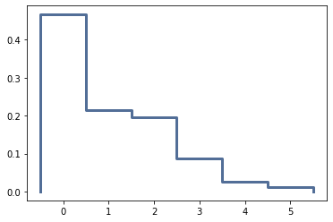
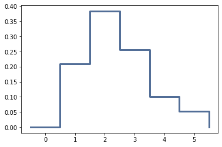
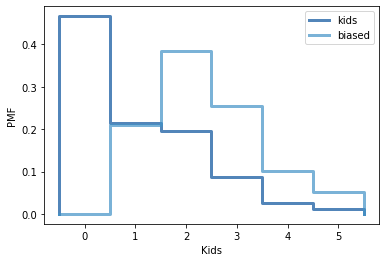

[Think Stats Chapter 3 Exercise 1](http://greenteapress.com/thinkstats2/html/thinkstats2004.html#toc31) (actual vs. biased)

Following the example in the text, we get the data:
```
kids = resp.numkdhh
```

Then you can get the actual pmf:
```
pmf = thinkstats2.Pmf(kids, 'kids')
thinkplot.Pmf(pmf)
```


Then get the biased pmf:
```
biased = BiasPmf(pmf, label='biased')
thinkplot.Pmf(biased)
```


Then get a nicer combined plot:
```
thinkplot.PrePlot(2)
thinkplot.Pmfs([pmf, biased])
thinkplot.Config(xlabel="Kids", ylabel='PMF')
```


Looks like from the kids' perspectives, there are more kids. Of course, many it looks like many couples don't have kids, so there are no kids to report that fact.

Here are the means:
```
pmf.Mean()
```
1.024205155043831

```
biased.Mean()
```
2.403679100664282

