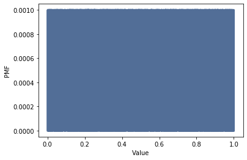
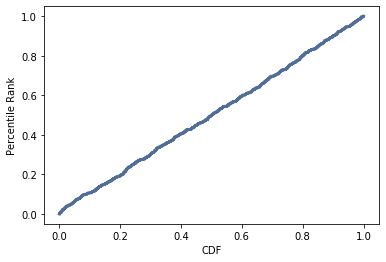

[Think Stats Chapter 4 Exercise 2](http://greenteapress.com/thinkstats2/html/thinkstats2005.html#toc41) (a random distribution)

### Plot of pmf:
```
pmf = thinkstats2.Pmf(rand_nums)
thinkplot.Pmf(pmf)
thinkplot.Config(xlabel='Value', ylabel='PMF')
```


This plot is sort of what you'd expect for a uniform distribution. It's rectangular in shape with equal intervals of values having the same total probability.  
It's a little odd because an actual uniform distribution is continuous, so some things don't quite make sense. For example, the height of a uniform distribution with a base from (0,1) is actually 1. What is being represented in the plot is the probability of any one sample out of the thousand. In a true continuous pdf, the probability of any single value is 0 (you have to talk about ranges in a continuous pdf). 


### Plot of cdf:
```
cdf = thinkstats2.Cdf(rand_nums)
thinkplot.Cdf(cdf)
thinkplot.Config(xlabel='CDF', ylabel='Percentile Rank')
```


This plot looks to be what you'd expect: a line with a slope of 1. To the left of 0, the value is 0. To the right of 1, the value is 1. In other words, as described in the text, the xth percentage of a sample matches the xth percentile. 
